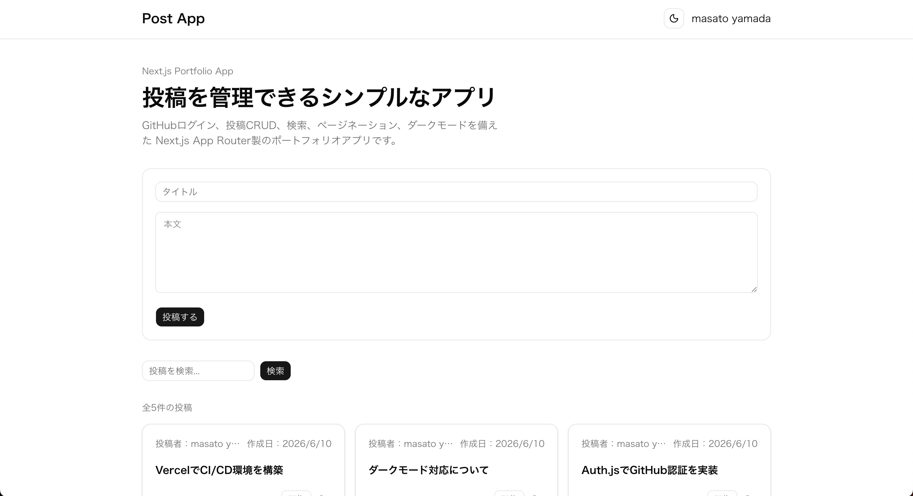
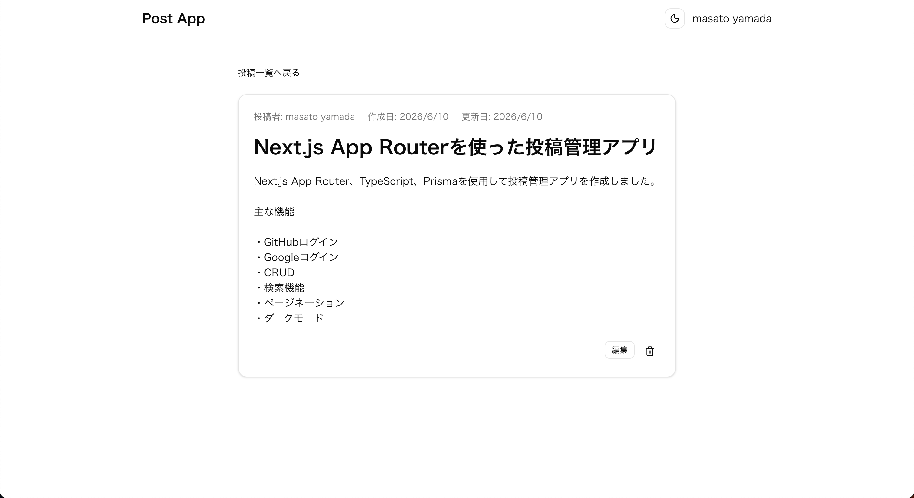
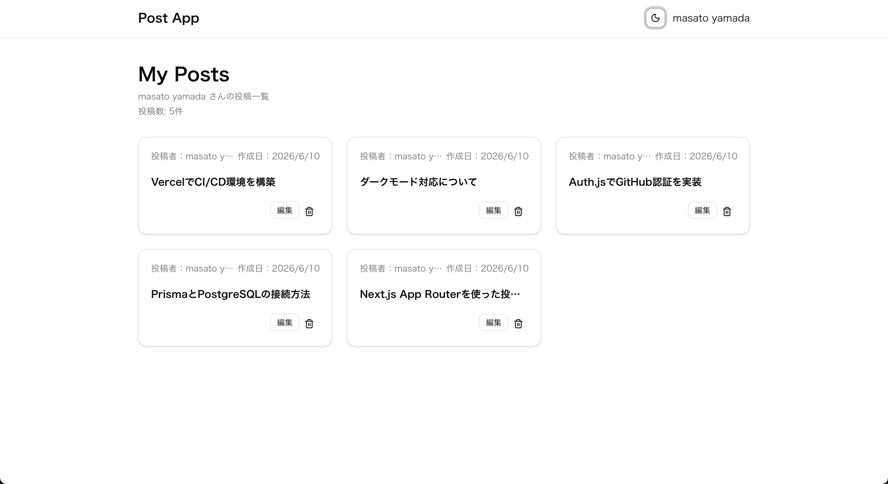
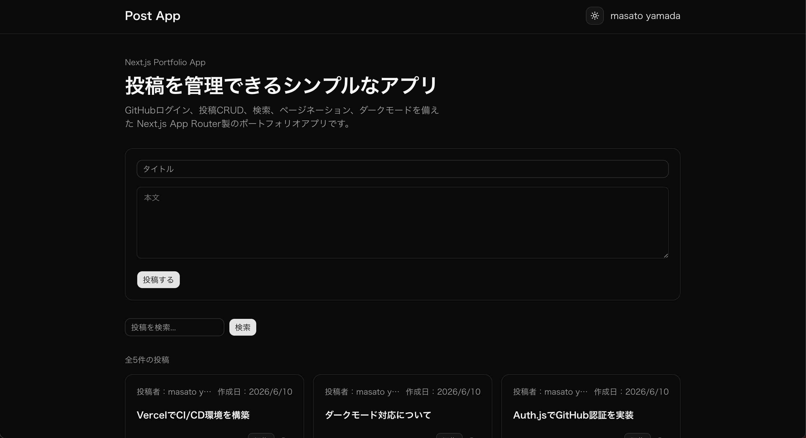

# Portfolio Posts App

Next.js App Router と Auth.js を使用して開発した投稿管理アプリです。

認証機能、投稿のCRUD、検索、ページネーション、ダークモードなど、実務でよく利用される機能を意識して実装しました。

## Demo

* Vercel: https://post-app-ruby.vercel.app/
* GitHub: https://github.com/otuq/post-app

## Screenshots

### Home

投稿作成・検索・ページネーション機能



### Post Detail

投稿詳細表示・編集・削除



### My Posts

ログインユーザー専用の投稿管理画面



### Dark Mode

ダークモード対応



## Features
GitHub Login
Google Login
Create Post
Update Post
Delete Post
Search
Pagination
My Posts
Dark Mode

## Tech Stack
Next.js App Router
TypeScript
Tailwind CSS
shadcn/ui
Prisma
PostgreSQL (Neon)
Auth.js
React Hook Form
Zod
Vercel

### Frontend

* Next.js App Router
* TypeScript
* Tailwind CSS
* shadcn/ui

### Backend

* Server Actions
* Prisma ORM
* PostgreSQL (Neon)

### Authentication

* Auth.js
* GitHub OAuth
* Google OAuth

### Form & Validation

* React Hook Form
* Zod

### Deployment

* Vercel

---

## Features

### Authentication

* GitHubログイン
* Googleログイン
* ログアウト

### Posts

* 投稿作成
* 投稿編集
* 投稿削除
* 投稿詳細表示
* マイページ投稿一覧

### Search & Navigation

* 投稿検索
* ページネーション
* 404ページ
* Error Boundary

### UI/UX

* ダークモード
* Toast通知
* Empty State
* Loading UI
* 削除確認ダイアログ

---

## Architecture

* App Router を利用したルーティング
* Server Actions を利用したデータ更新
* Prisma を利用したデータアクセス
* ActionResult によるレスポンス形式の統一
* Zod による入力値検証
* 認証ユーザーのみ編集・削除可能

---

## Database

### Post

| Column    | Type     |
| --------- | -------- |
| id        | String   |
| title     | String   |
| content   | String   |
| authorId  | String   |
| createdAt | DateTime |
| updatedAt | DateTime |

### User

Auth.js 管理

---

## Local Development

```bash
git clone <repository>

cd <project>

npm install

npm run dev
```

### Environment Variables

```env
DATABASE_URL=

AUTH_SECRET=

AUTH_GITHUB_ID=
AUTH_GITHUB_SECRET=

AUTH_GOOGLE_ID=
AUTH_GOOGLE_SECRET=
```

---

## Deployment

VercelとGitHubを連携し、mainブランチへのpushをトリガーに自動で本番環境へデプロイされる構成にしています。

また、ブランチごとにPreview Deployが作成されるため、本番反映前に変更内容を確認できます。

## What I Learned

* Next.js App Router
* Server Actions
* Prisma ORM
* PostgreSQL
* OAuth認証
* React Hook Form + Zod
* コンポーネント設計
* エラーハンドリング

---

## Future Improvements

* 画像アップロード
* コメント機能
* いいね機能
* E2Eテスト導入
* CI/CD導入
